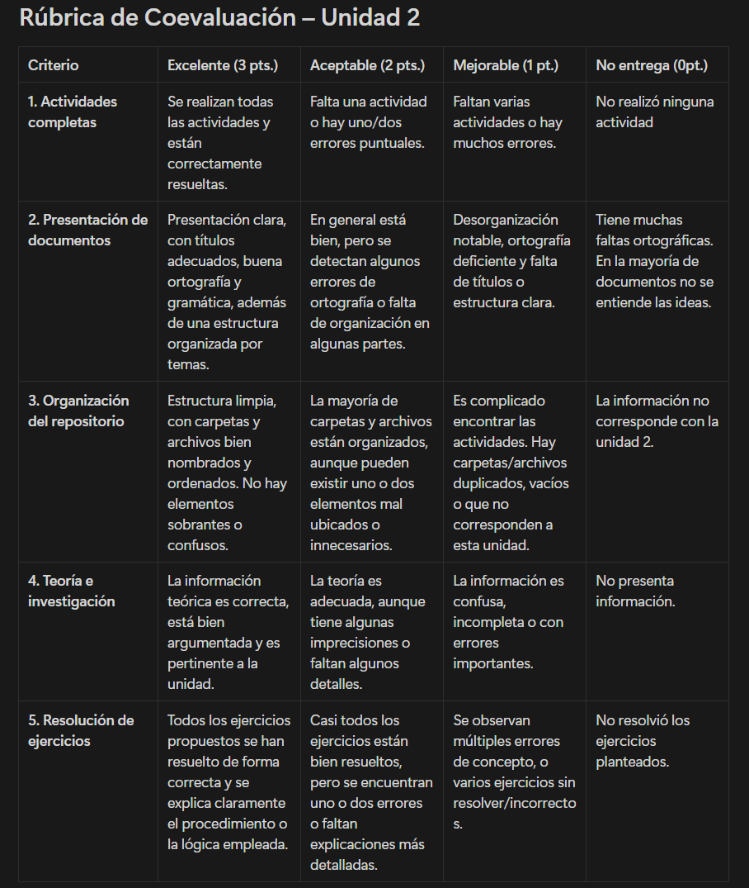

# Coevaluacipon hecha por: Samuel Andres Jimenez Sanchez
|Criterio|Excelente (3pts.)|Aceptable (2pts.)|Mejorable (1pt.)|No entrega (0pt.)|
|---|---|---|---|---|
|1. Actividades completas|X|||
|2. Presentacion de documentos||X||
|3. Organizacion del repositorio||X||
|4. Teoria e investigacion|X|||
|5. Resolucion de ejercicios|X|||

## 1. Actividades Completas
Todas las actividades estan completas, no he visto que haya faltado algo.

## 2. Presentacion de documentos
En cuanto a la ortografía no detecto errores, todo es coherente pero si se nota en los documentos un poco de desorden, todo está en el mismo formato, no hay titulos diferenciadores en la mayoría de los archivos y las fotos, a pesar de estar insertadas no se alcanzan a apreciar en la previsualización. Se sugiere mejorar el orden en estos archivos.

## 3. Organización del repositorio
En el repositorio se alcanza a ver que todas las actividades están por fuera de una carpeta y hay archivos sin titulo o tipo de archivo como la actividad 2, además hay algunos archivos que al abrirlos, estan mal insertados porque solo se alcanza a ver el codigo mas no su contenido.

## 4. Teoría e investigación 
La información es clara y acorde a lo solicitado, añade las fuentes.

## 5. Resolución de ejercicios
Los ejercicios están bien resueltos.

## Nota: 13 de 15 puntos. __4.3__